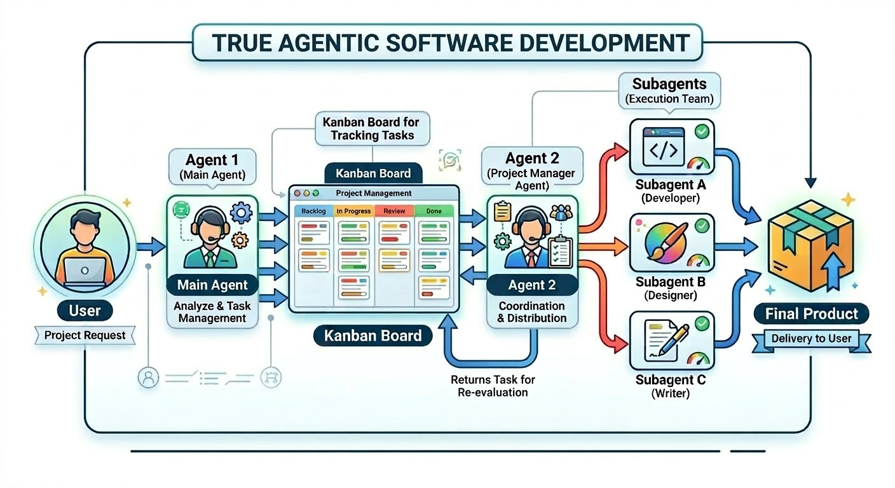

# Agentic Kanban Workspace

This repository provides a complete toolkit for scaffolding a self-contained, Kanban-driven development workspace specifically optimized for the Gemini CLI and its autonomous AI agents. By integrating a dedicated Kanban board with strict Model Context Protocol (MCP) hooks, this environment ensures that your AI agents follow a governed, failure-preventing engineering loop.

Once the setup is complete, you will have a ready-to-use template that can be copied into any existing project folder, instantly equipping it with a full agentic software development team and strict quality control guardrails.

## What's Included
* **[Plane](https://github.com/makeplane/plane) Kanban Server:** A fully functional, self-hosted project management suite (a true open-source alternative to Jira).
* **60+ Specialized AI Agents:** A massive library of purpose-built [Gemini Agents](https://github.com/adamoutler/gemini-agency-agents) adapted from the open-source [Agency Agents](https://github.com/msitarzewski/agency-agents) framework.
* **Automated QA Hooks:** Built-in hooks that enforce quality control before tickets can be marked as done (source code included).
* **Agent Capabilities:** Pre-configured skills that allow your AI to autonomously manage the Kanban board and execute tasks.
* **Drop-in Project Template:** A ready-to-use workspace template that instantly injects this entire ecosystem into any existing repository.

## Requirements
Before starting, ensure your system has the following installed:
- [Docker](https://docs.docker.com/get-docker/) and Docker Compose
- [Gemini CLI](https://github.com/google/gemini-cli)
- `git`
- `bash`
- `jq`
- `openssl`
- `python3` (for agent installation scripts)

## Installation and Usage

To get started, navigate to this project's directory and simply tell Gemini to set it up:

> set it up

### The `workspace-setup` Master Skill
This skill orchestrates the entire end-to-end process:
1. **Domain Selection:** Asks you for a domain or IP to bind the server to.
2. **Plane Deployment:** Automatically generates and deploys a fully local, Docker-containerized instance of [Plane](https://plane.so/).
3. **Configuration:** Guides you through initializing Plane, creating a Workspace Slug, and extracting your API Key.
4. **Kanban MCP Setup:** Seamlessly connects your local Gemini CLI workspace to the Kanban board via the [Model Context Protocol (MCP)](https://modelcontextprotocol.io/), generating `.gemini/.env` and `.gemini/settings.json`.
5. **Agent Installation:** Downloads the `gemini-agency-agents` submodule and installs the 60+ specialized subagents to your preferred directory.
6. **Project Template:** Compiles the final template folder (`template/.gemini/`), complete with modular prompt files and hooks, ready to be copied into your target project.

## Features & Governance
By utilizing the output of this setup, your project will benefit from a highly governed "Universal Quality Control Gate":
- **Automated Workflow:** The included `agents-orchestrator.md` configures the primary Gemini agent to automatically read tickets, spawn specialized sub-agents, and coordinate the Dev-QA validation loop.
- **Security & Workflow Hooks:** Included bash hooks actively intercept tool calls to enforce the process:
  - `prevent-curl-bypass.sh`: Prevents the AI from bypassing the verification pipeline by closing Kanban tickets via direct HTTP requests using CLI tools like `curl` or `gh`.
  - `qa-gate.sh`: Utilizes the `@reality-checker` subagent to enforce strict evidence verification before allowing a ticket to transition to Done via the Kanban MCP.
  - `validate-ticket.sh`: An additional guardrail that strictly forbids manually transitioning tickets to Done using standard MCP update calls, forcing reliance on the official QA validation pipeline.
  - *Recommendation:* We strongly recommend implementing a local `post-commit` git hook to automatically run your unit tests. This ensures the AI receives immediate, empirical feedback on build failures right in its context window.
  - *Security Best Practice:* To prevent the AI from modifying these control scripts and bypassing the system, we recommend making your `.gemini` folder owned by root and removing write permissions for the group after setup is complete (e.g., `sudo chown -R root .gemini && sudo chmod -R g-w .gemini`).

## Next Steps
Once your workspace is up and running, we highly recommend managing your agents using the [Gemini WebUI](https://github.com/adamoutler/gemini-webui). 

Gemini WebUI provides a seamless, mobile-first web interface that allows you to maintain persistent terminal sessions, manage multiple scoped environments, easily upload files in bulk, and control your AI development workflows from any device.

